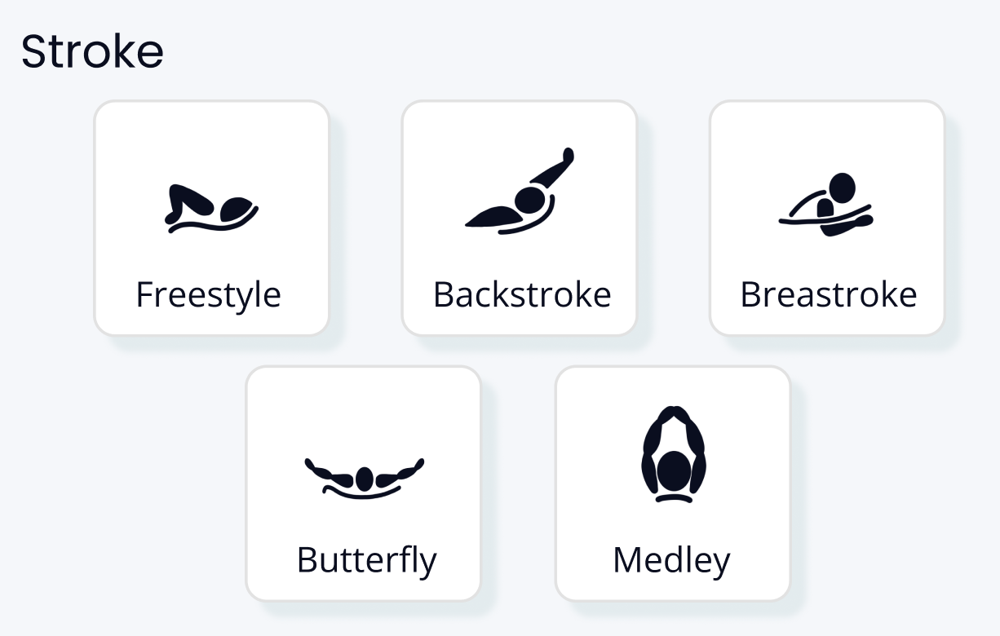
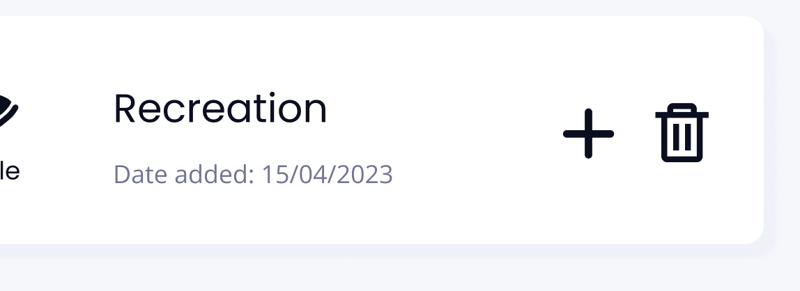

# cgue0717-tracker

# Documentation

## Iterations
* As part of my design process, there were several iterations made between the proposed design and the final prototype. One major change includes the removal of the insights section on the interface's main dashboard. This was removed as ultimately, it was outside the scope of the assignment and would require use of the web application over a long period of time in order to appear effective. Slight changes were made to the overall design of the user input form, however these were made due to the limitations of my own ability to code and troubleshoot. This is evidenced through the layout of the radio boxes displaying different stroke options that the user can choose. I also struggled to add box-shadow to each of the user inputs on the form but this was at no loss as the CSS box-shadow feature is not compatible with every web browser. 

## Possible improvements
* Whilst trying to remain as close to the proposed design in the final prototype, my personal coding skills served to hinder my ability to execute the final product. This was particularly evident as I tried to display the user input on the dashboard once the user had submitted the required information. I used the < details > and < summary > tag to create the dropdown feature which would allow users to expand a ‘session’ to find out more information. Whilst this worked out well I also found the general styling of these tags very difficult because of the dropdown arrow which would appear on the left. In my original design I had intended there to be a ‘plus’ symbol that users could press on in order to expand the ‘session’ info. However because of the styling of these two tags I found that very hard to do and ultimately forgoed it. Similarly, I was also going to have a ‘trash can’ symbol next to this plus symbol so that users would be able to remove the session info if they wanted to. Using appendChild() in a variety of manners I could not place that bin on the right and in every circumstance it would end up on the bottom of the ‘list’ outside the < details > and < summary >. After lots of troubleshooting, I could not rectify this situation but recommend that these features be improved as it is an eyesore and would serve to benefit the appeal of the design. 

## Application's configuration and deployment
* This web application works best with desktop screen dimensions and was designed with all web browsers in mind, particularly chrome. That being said, this web application is responsive to different screen sizes and can also be viewed using mobile screen dimensions. Interacting with the web application is quite simple, and was purposefully designed with ease of use for the user. This means that there are no additional steps to use this web application and users simply need to access the app via the URL. 

* As part of the web application deployment procedures, developers will need to run ‘npm install’ to download the dependencies. For this web application to work efficiently, parcel/resolver-glob version 2.9.1, parcel/transformer-sass version 2.9.1, and parcel version 2.9.1 should be installed. To start the server, developers may choose to use either ‘npm run start’ or ‘npm run dev’. However, I personally suggest using ‘npm run dev’ as the site loads faster. 